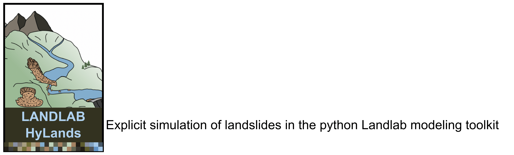

# HyLands

This is a landing page documenting the Hybrid Landscape evolution model (HyLands). The page will be updated with scientific findings, modeling results as well as tutorials on the use of the HyLands modeling software.

## Topics

| Topic | Run on...
| ----- | ---------
| [HyLands: Hybrid large scale landscape evolution][hylands] | [![Run on CSDMS JupyterHub][badge]][gp-hylands]

## Requirements

* Laptop
* Web browser
* Internet
* Coffee or Tea (optional, but recommended)

## Links

## Model development and collaboration

Main developer
* [Benjamin Campforts](https://instaar.colorado.edu/people/benjamin-campforts/)

Contributors
* [Charles Shobe](https://www.geo.wvu.edu/faculty-and-staff/faculty/charlie-shobe)
* [Eric Hutton](https://instaar.colorado.edu/people/eric-hutton/)
* [Mark Piper](https://instaar.colorado.edu/people/mark-piper/)
* [Greg Tucker](https://www.colorado.edu/geologicalsciences/greg-tucker)
* [Irina Overeem](https://www.colorado.edu/geologicalsciences/irina-overeem)
* [Jean Braun](https://www.gfz-potsdam.de/en/staff/jean-braun/sec47/)

HyLands is part of Landlab, a community-focused project;
[contributions](./CONTRIBUTING.rst) that follow
the [contributor code of conduct](./CODE-OF-CONDUCT.rst) are welcomed,
and are [acknowledged](./AUTHORS.rst).
All HyLands material is open source,
released under [CC BY 4.0 and MIT licenses](./LICENSE.md).
If you use the HyLands course material,
please cite it:

* Campforts, B., Shobe, C. M., Overeem, I., Tucker, E. G. (in review)
* Campforts, B., Shobe, C. M., Steer, P., Vanmaercke, M., Lague, D., and Braun, J.: HyLands 1.0: a hybrid landscape evolution model to simulate the impact of landslides and landslide-derived sediment on landscape evolution, Geosci. Model Dev., 13, 3863–3886, [10.5194/gmd-13-3863-2020](https://doi.org/10.5194/gmd-13-3863-2020), 2020.

<!-- Links -->
[badge]: https://img.shields.io/badge/CSDMS-JupyterHub-orange.svg
[hylands]: ./tutorials/index.ipynb
[gp-hylands]: https://csdms.rc.colorado.edu/hub/user-redirect/git-pull?repo=https%3A%2F%2Fgithub.com%2FBCampforts%2Fhylands_modeling&urlpath=tree%2Fhylands_modeling%2Ftutorials%2Findex.ipynb&branch=master
